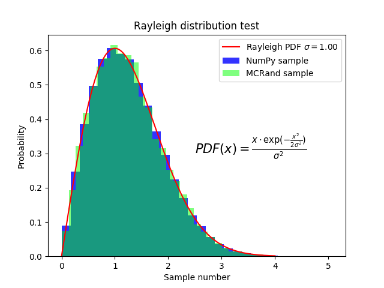

# MCRand
MCRand is a library of Monte Carlo methods. Multidimensional integration, non-uniform random number generation, etc.

# Random Number Generator
In the [MCRand_tests](/MCRand_tests.py) you can find a comparison between MCRand and Numpy for different proability distributions. Moreover, we use the program to generate random samples drawn from non-standard distributions. Anyway, we show here a quick guide to use MCRand library to generate the outputs of [MCRand_tests](/MCRand_tests.py).

To use the MCRand library to generate random numbers we first need to import the random generator (RandGen). This step can be done in the following way

```python
from MCRand import RandGen as rg
```

## Gaussian distribution

To generate gaussian distributed numbers with the MCRand random generator we first need to define the Gaussian PDF

```python
def gaussian(x, mu, sigma):
	return (1/(np.sqrt(2*np.pi*sigma**2))) * np.exp(-(x-mu)**2/(2*sigma**2))
```

Then, MCRand can be used to generate `N` gaussian numbers from `x0` to `xf` as follows

```python
x0 = -5
xf = 5
N = 1000

sigma = 1
mu = 0

gaussian_sample = rg.sample(gaussian, x0, xf, N, mu, sigma)
```

Finally to plot the histogram and the PDF we can use matplotlib.pyplot

```python
plt.hist(gaussian_sample, bins=30, density=True, color=(0,1,0,0.5), label='MCRand sample')
plt.plot(x, gaussian(x, mu, sigma), color='r', label=r'Gaussian PDF $\mu=%.2f$, $\sigma=%.2f$' % (mu,sigma))
```


## Cauchy distribution

To generate a Cauchy distribution we need to define its PDF

```python
def cauchy(x, x0, gamma):
	return 1 / (np.pi * gamma * (1 + ((x-x0)/(gamma))**2))
```

and then use the random number generator of MCRand as before

```python

x0 = -10
xf = 10
N = 10**5

x0_cauchy = 0
gamma = 1

cauchy_sample = rg.sample(gaussian, x0, xf, N, mu, sigma)
```

Finally we plot the histogram and the PDF 

```python
plt.hist(cauchy_sample, bins=50, density=True, color=(0,1,0,0.5), label='MCRand sample')
plt.plot(x, cauchy(x, x0_cauchy, gamma), color='r', label=r'Cauchy PDF $\gamma=%.2f$, $x_0=%.2f$' % (gamma, x0_cauchy))
```


From now on, we'll just write some code along with the output figures of the [MCRand_tests](/MCRand_tests.py) file.

## Exponential distribution

```python
def exponential(x):
	return np.exp(-x)

x0 = 0
xf = 10
N = 10**5

rand = rg.sample(exponential, x0, xf, N)

plt.hist(numpy_rand, bins=30, density=True, color=(0,0,1,0.8), label='NumPy sample')
plt.hist(rand, bins=30, density=True, color=(0,1,0,0.5), label='MCRand sample')

```


## Rayleigh distribution

```python

def rayleigh(x, sigma):
	return (x*np.exp(-(x**2)/(2*sigma**2))) / (sigma**2)
  
x0 = 0
xf = 4
sigma = 1
N = 10**5
  
rand = rg.sample(rayleigh, x0, xf, N, sigma)

plt.hist(rand, bins=30, density=True, color=(0,1,0,0.5), label='MCRand sample')
plt.plot(x, rayleigh(x, sigma), color='r', label=r'Rayleigh PDF $\sigma=%.2f$' % sigma)

```



## Maxwell-Boltzmann distribution

```python
def maxwell_boltzmann(x, sigma):
	return (np.sqrt(2/np.pi))*(x**2*np.exp(-(x**2)/(2*sigma**2))) / (sigma**3)

x0 = 0
xf = 10
sigma = 2
N = 10**5

rand = rg.sample(maxwell_boltzmann, x0, xf, N, sigma)

plt.hist(rand, bins=30, density=True, color=(0,1,0,0.5), label='MCRand sample')
plt.plot(x, maxwell_boltzmann(x, sigma), color='r', label=r'Maxwell-Boltzmann PDF $\sigma=%.2f$' % sigma)

```


## Symmetric Maxwell-Boltzmann distribution

```python
def symmetric_maxwell_boltzmann(x, sigma):
	return 0.5*(np.sqrt(2/np.pi))*(x**2*np.exp(-(x**2)/(2*sigma**2))) / (sigma**3)
	
x0 = -10
xf = 10
sigma = 2
N = 10**5

rand = rg.sample(symmetric_maxwell_boltzmann, x0, xf, N, sigma)

plt.hist(rand, bins=40, density=True, color=(0,1,0,0.5), label='MCRand sample')
plt.plot(x, symmetric_maxwell_boltzmann(x, sigma), color='r', label=r'Maxwell-Boltzmann PDF $\sigma=%.2f$' % sigma)
```


## Modified Rayleigh distribution

Finally we consider a invented probability distribution, given by the Rayleigh distribution multiplied by `x`. In some way we making a symmetric Rayleigh distribution. Then, this new distribution must be normalized, so the following equation must be acomplished:


By nummeric integration it turns out that the normalization constant must be `C=1/2.506628`. Then we get the probability density function for this distribution.

Therefore, MCRand can be used to generate random numbers distributed following this distribution as follows

```python
def invented(x, sigma):
	return (x**2*np.exp(-(x**2)/(2*sigma**2))) / (2.506628*sigma**2)

x0 = -4
xf = 4
sigma = 1
N = 10**5

rand = rg.sample(invented, x0, xf, N, sigma)

plt.hist(rand, bins=40, density=True, color=(0,1,0,0.5), label='MCRand sample')
plt.plot(x, invented(x, sigma), color='r', label=r'Modified Rayleigh PDF $\sigma=%.2f$' % sigma)
```


# Multidimensional Integration

To use the MCRand library to perform multidimensional integrals we first need to import the Integrate module. This step can be done in the following way

```python
from MCRand import Integrate as integrate
```

Then, we must define the function to integrate in an NumPy ndarray supported way, so it must be defined generally. For instance let's imagine we want so solve the following integral:


Then we should define the function as

```python

def func(x):
	return np.sum(np.power(x, 2))
```

so each element of the x array will represent a variable.

Finally, to get the result with  its error we can run the following code

```python
x0 = [0, 0]
xf = [2, 3]
N = 10**6

result = integrate.UniformSampling(func, x0, xf, N)

print(result)
```
The result is given in the following format

```python
(25.99767534344232, 0.02023068196284685)
```
